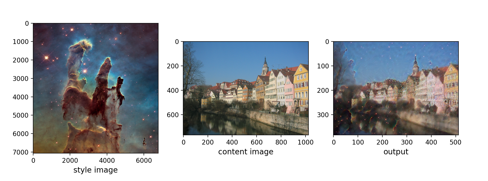
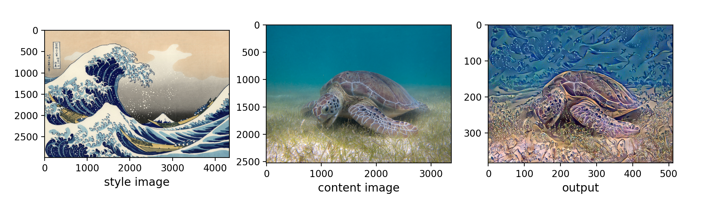

# neural-style-transfer-pytorch

Pytorch implementation of the paper titled *A Neural Algorithm of Artistic Style*. 

### Sample output

### Instructions:

* edit `./config.yml` to modify hyperparameters
* run `python run.py`
    * running with no args causes the model to use a pair of example image files present in `./data`
    * specify custom images using args `-i, --input-image` and `-s, --style-image`
* output of model are saved in `./data/output/<timestamp>` folder in the format `iter-XYZ.png`

### Readings

* [Paper by Gatys et al.](https://arxiv.org/abs/1508.06576)

### Update log

* 2021-06-28 - first upload
